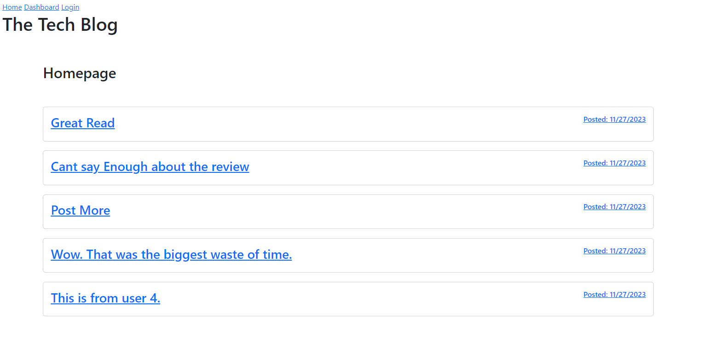

# My Tech Blog 3000

## Description

- This app was made with the intent on gaining real world experience with making API
  calls. This app is a site where a user can post about tehcnology related topics. Other users can also comment on their post.

### Usage

- To use this app is relatively simple and user friendly. It is very similar to other app you have seen in the market, so it should have a familiar feel. When the app first load, you have to either login or register a new user. Once you are logged in, you have access to the blogs and the ability to create them too. You can also see other users blogs and post a comment on them. In you Dashboard page is where you are able to create and edit post. You have the ability to chage and delete your own posts. lastly, once you are done, you can logout.

### Screenshots

### Links

- GitHub link: https://github.com/Sal1316/my-tech-blog-3000

- Heroku Deployed Url: https://intense-forest-59647-751536f32084.herokuapp.com/
